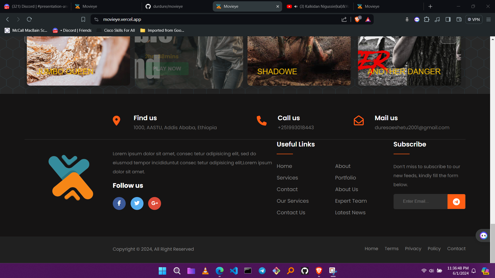

# MOVIEYE

MOVIEYE is a powerful and user-friendly movie database application designed to help users discover, track, and review movies. It provides an extensive database of movies along with detailed information such as cast, crew, reviews, ratings, and more. The application offers an intuitive interface and robust search functionality, making it easy for users to find their favorite movies or explore new ones.



## Features

- **Comprehensive Movie Database**: Access detailed information on a wide range of movies.
- **Search Functionality**: Quickly find movies by title, genre, cast, or keywords.
- **User Reviews and Ratings**: Read and write reviews and rate movies.
- **Watchlist**: Create and manage a personalized watchlist.
- **Recommendations**: Get movie recommendations based on your watch history and preferences.
- **Cast and Crew Information**: View detailed information about actors, directors, and other crew members.
- **Responsive Design**: Enjoy a seamless experience across various devices.

## Installation

To install and run MOVIEY locally, follow these steps:

1. **Clone the Repository**

    ```bash
    git clone https://github.com/durdure/movieye.git
    cd MOVIEY
    ```

2. **Install Dependencies**

    Make sure you have [Node.js](https://nodejs.org/) installed. Then, install the necessary dependencies:

    ```bash
    npm install
    ```

3. **Set Up Environment Variables**

    Create a `.env` file in the root directory and add the following variables:

    ```env
    REACT_APP_API_KEY=your_api_key_here
    REACT_APP_API_URL=https://api.themoviedb.org/3
    ```

4. **Run the Application**

    Start the development server:

    ```bash
    npm start
    ```

    The application will be available at `http://localhost:3000`.

## Usage

Once the application is up and running, you can:

- **Search for Movies**: Use the search bar to find movies by title, genre, or keywords.
- **View Movie Details**: Click on a movie to see detailed information, including synopsis, cast, crew, and user reviews.
- **Add to Watchlist**: Click the "Add to Watchlist" button on a movie's page to save it to your watchlist.
- **Rate and Review**: Submit your own ratings and reviews for movies you've watched.
- **Get Recommendations**: Check out the recommended movies based on your watchlist and ratings.

## Contributing

We welcome contributions from the community! To contribute to MOVIEY, please follow these steps:

1. **Fork the Repository**

    Click the "Fork" button on the top right of the repository page to create a copy of the repository on your GitHub account.

2. **Clone Your Fork**

    ```bash
    git clone https://github.com/durdure/MOVIEY.git
    cd MOVIEY
    ```

3. **Create a Branch**

    Create a new branch for your feature or bugfix:

    ```bash
    git checkout -b feature/durdure_st.
    ```

4. **Make Changes**

    Make your changes in the codebase. Ensure your code adheres to the project's coding standards and passes all tests.

5. **Commit and Push**

    Commit your changes and push them to your fork:

    ```bash
    git add .
    git commit -m "Movieye"
    git push origin feature/durdure_st.
    ```

6. **Create a Pull Request**

    Go to the original repository and click the "New Pull Request" button. Provide a detailed description of your changes and submit the pull request.

## License

This project is licensed under the MIT License. See the [LICENSE](LICENSE) file for more details.

---